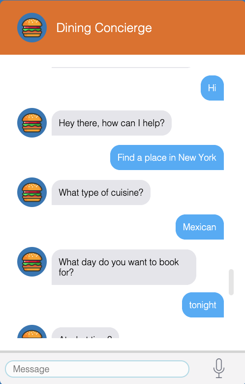
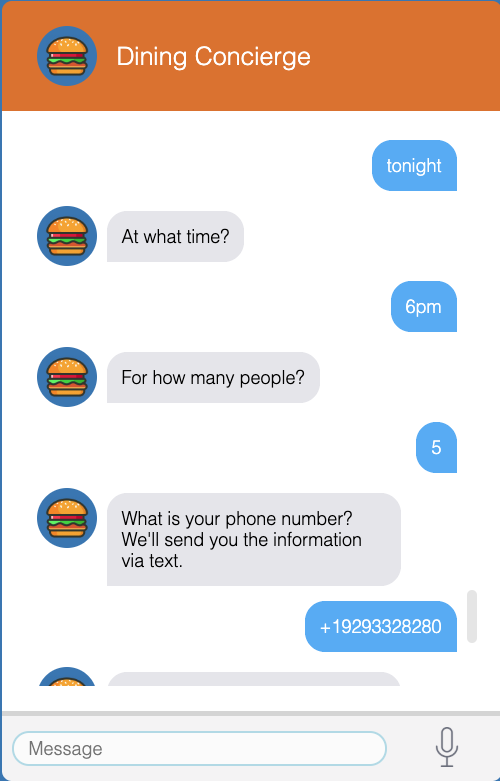
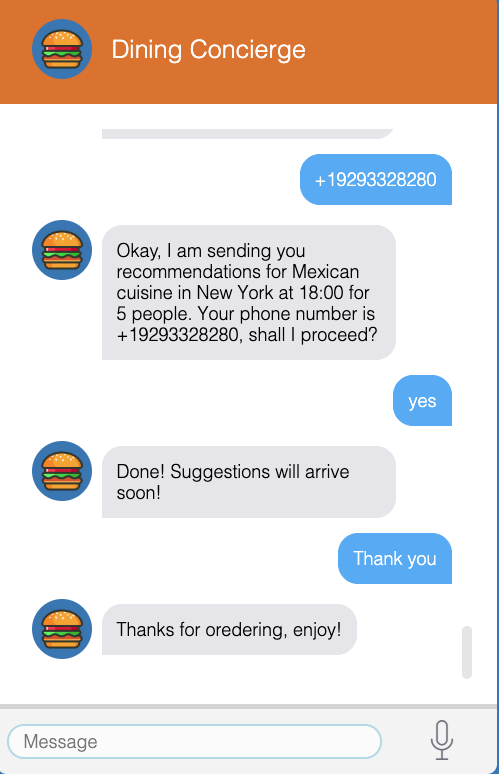

# Dining-Concierge-chatbot
Sends you restaurant suggestions given a set of preferences that you provide the chatbot through the conversations. 

### Demo of a sample conversation 

1. GreetingIntent Handled: 

2. SuggestionsIntent:

3. ThankYouIntent:

### List of services utilised:

<ol>
	<li> AWS S3 </li>
	<li> AWS apigateway </li>
	<li> AWS Lex </li>
	<li> AWS Lambda </li>
	<li> AWS SQS </li>
	<li> AWS SNS </li>
	<li> AWS ElasticSearch </li>
	<li> AWS CloudWatch </li>
	<li> Yelp API </li>
	<li> DynamoDB </li>
</ol>
